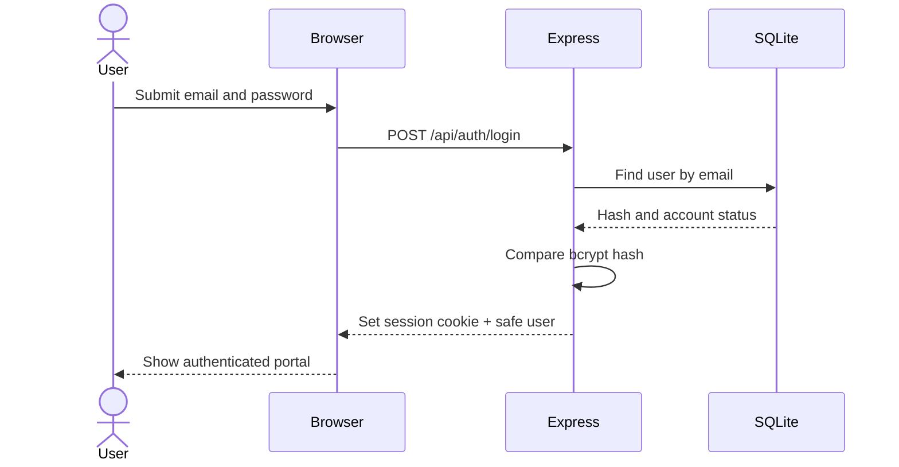
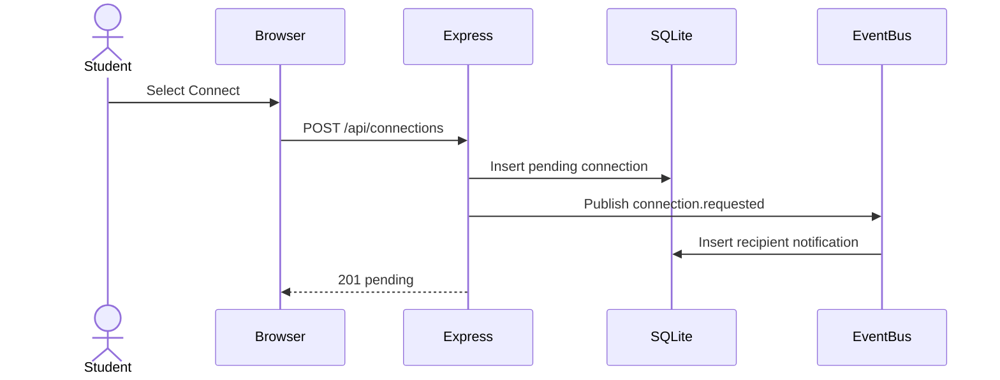
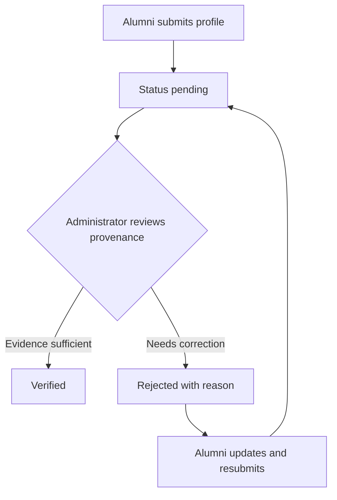

# Workflow diagram sources

## Login sequence

```mermaid
sequenceDiagram
  actor User
  participant UI as Browser
  participant API as Express
  participant DB as SQLite
  User->>UI: Submit email and password
  UI->>API: POST /api/auth/login
  API->>DB: Find user by email
  DB-->>API: Hash and account status
  API->>API: Compare bcrypt hash
  API-->>UI: Set session cookie + safe user
  UI-->>User: Show authenticated portal
```

## Connection request sequence

```mermaid
sequenceDiagram
  actor Student
  participant UI as Browser
  participant API as Express
  participant DB as SQLite
  participant Bus as EventBus
  Student->>UI: Select Connect
  UI->>API: POST /api/connections
  API->>DB: Insert pending connection
  API->>Bus: Publish connection.requested
  Bus->>DB: Insert recipient notification
  API-->>UI: 201 pending
```

## Alumni verification activity

```mermaid
flowchart TD
  A[Alumni submits profile] --> B[Status pending]
  B --> C{Administrator reviews provenance}
  C -->|Evidence sufficient| D[Verified]
  C -->|Needs correction| E[Rejected with reason]
  E --> F[Alumni updates and resubmits]
  F --> B
```
